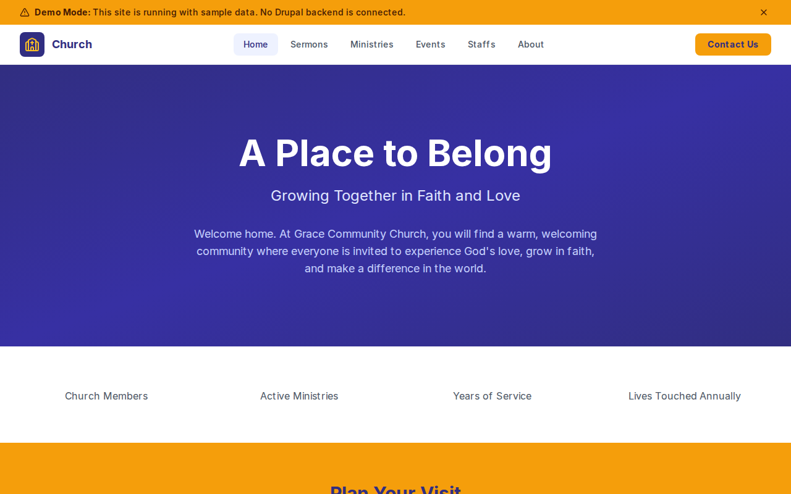

# Decoupled Church

A church website starter template for Decoupled Drupal + Next.js. Built for churches, parishes, and faith communities looking for a modern online presence.



## Features

- **Sermons** - Publish weekly messages with speaker, series, video/audio links, and scripture references
- **Ministries** - Showcase church ministries and groups with leaders, schedules, and meeting locations
- **Church Events** - Promote worship services, VBS, fundraisers, and community gatherings with registration
- **Staff Directory** - Pastoral and support staff profiles with roles and contact information
- **Modern Design** - Clean, accessible UI optimized for church and ministry content

## Quick Start

### 1. Clone the template

```bash
npx degit nextagencyio/decoupled-church my-church
cd my-church
npm install
```

### 2. Run interactive setup

```bash
npm run setup
```

This interactive script will:
- Authenticate with Decoupled.io (opens browser)
- Create a new Drupal space
- Wait for provisioning (~90 seconds)
- Configure your `.env.local` file
- Import sample content

### 3. Start development

```bash
npm run dev
```

Visit [http://localhost:3000](http://localhost:3000)

---

## Manual Setup

<details>
<summary>Click to expand manual setup steps</summary>

### Authenticate with Decoupled.io

```bash
npx decoupled-cli@latest auth login
```

### Create a Drupal space

```bash
npx decoupled-cli@latest spaces create "My Church"
```

Note the space ID returned. Wait ~90 seconds for provisioning.

### Configure environment

```bash
npx decoupled-cli@latest spaces env 1234 --write .env.local
```

### Import content

```bash
npm run setup-content
```

This imports:
- Homepage with hero, statistics, and call to action
- 4 Sermons across multiple sermon series
- 4 Ministries (Youth, Worship, Outreach, Small Groups)
- 3 Church Events (Easter, VBS, Fundraiser)
- 3 Staff Members (Senior Pastor, Associate Pastor, Youth Pastor)
- 2 Static Pages (About, Plan Your Visit)

</details>

## Content Types

### Sermon
- **Sermon Series** - Taxonomy grouping (Faith Foundations, Walking in Grace, etc.)
- **Sermon Date** - When the sermon was delivered
- **Speaker** - Pastor or guest speaker name
- **Video URL / Audio URL** - Links to sermon media
- **Featured Image** - Sermon artwork or photo

### Ministry
- **Ministry Area** - Category (Youth & Children, Worship & Music, Community Outreach, etc.)
- **Leader Name** - Ministry leader or team
- **Meeting Schedule** - When the group meets
- **Location** - Where the group meets
- **Featured Image** - Ministry photo

### Church Event
- **Event Date / End Date** - Event timing
- **Location** - Where the event takes place
- **Event Type** - Category (Worship Service, Community Event, Youth Event, Fundraiser, Bible Study)
- **Registration URL** - Link to sign up
- **Event Image** - Promotional image

### Staff Member
- **Position/Title** - Role at the church
- **Email / Phone** - Contact information
- **Photo** - Staff headshot

### Basic Page
- Static content pages (About, Plan Your Visit, etc.)

## Customization

### Colors & Branding
Edit `tailwind.config.js` to customize colors, fonts, and spacing.

### Content Structure
Modify `data/church-content.json` to add or change content types and sample content.

### Components
React components are in `app/components/`. Update them to match your design needs.

## Demo Mode

Demo mode allows you to showcase the application without connecting to a Drupal backend.

### Enable Demo Mode

```bash
NEXT_PUBLIC_DEMO_MODE=true
```

### Removing Demo Mode

1. Delete `lib/demo-mode.ts`
2. Delete `data/mock/` directory
3. Delete `app/components/DemoModeBanner.tsx`
4. Remove `DemoModeBanner` from `app/layout.tsx`
5. Remove demo mode checks from `app/api/graphql/route.ts`

## Deployment

### Vercel (Recommended)
[](https://vercel.com/new/clone?repository-url=https://github.com/nextagencyio/decoupled-church)

### Other Platforms
Works with any Node.js hosting platform that supports Next.js.

## Documentation

- [Decoupled.io Docs](https://www.decoupled.io/docs)
- [Next.js Documentation](https://nextjs.org/docs)
- [Drupal GraphQL](https://www.decoupled.io/docs/graphql)

## License

MIT
